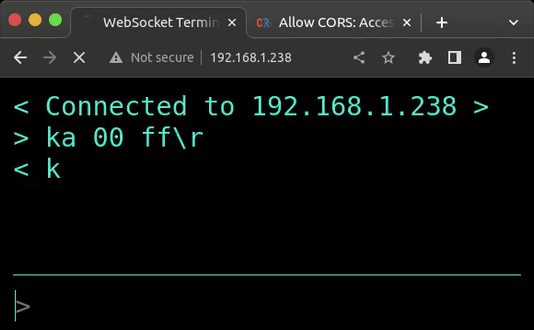

# pico-ws-uart

A WebSocket to UART bridge on the PicoW. Permits serial communication with a device over WebSocket.

## Building

Clone repository and cd
```shell
git clone https://github.com/kennedn/pico-ws-uart.git
cd pico-ws-uart
```

Make build folder and cd
```shell
mkdir build
cd build
```

Run cmake
```shell
cmake .. -DWIFI_SSID="YOUR_WIFI_SSID" -DWIFI_PASSWORD="YOU_WIFI_PASSWORD"
```

Compile the application
```shell
cd app
make -j 4
```

## Usage

By default the uart config is `UART_0` with `tx = GP0` and `rx = GP1`.

> NOTE: UART configuration and Debug information can be configured in the apps [CMakeLists.txt](./app/CMakeLists.txt)

When the device receives a message from a client, it will echo it on the `tx` pin. When UART data is received on the `rx` pin, it will be sent as a message to all connected WebSocket clients.

Client connections to the server that do not request a WebSocket upgrade (e.g Web Browsers) will be served a static HTML webpage that allows basic interaction with the websocket:



## Thanks

Thanks to [cadouthat](https://github.com/cadouthat) for the amazing [pico-ws-server](https://github.com/cadouthat/pico-ws-server) library.
